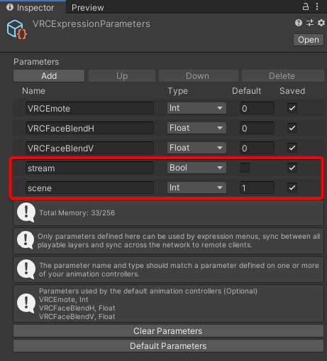
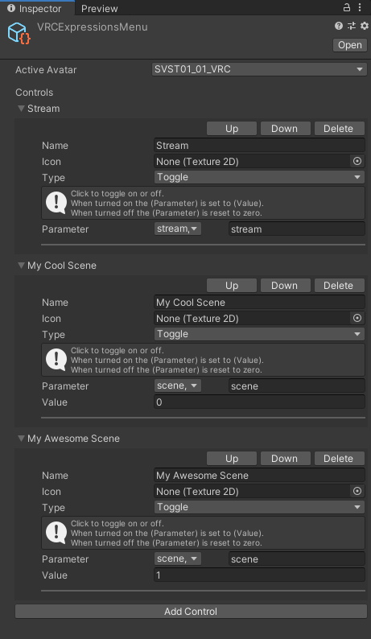
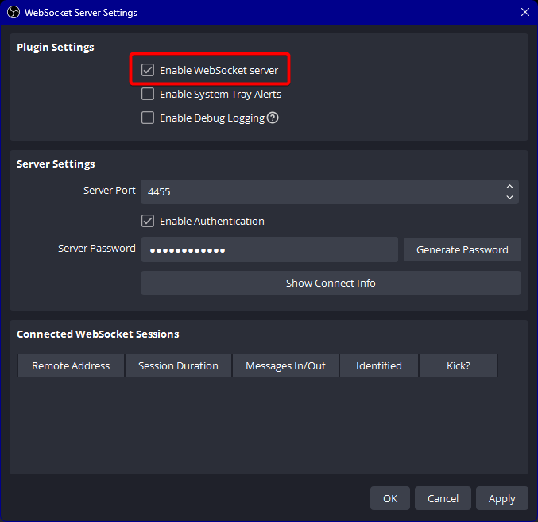

# VRChat OBS OSC
A tool to control OBS from VRChat avatar expression menu.

## Demo
https://user-images.githubusercontent.com/15815422/228437901-6773ded2-a492-44f5-b093-44415c49b701.mp4

## Features
- Start / Stop stream.
- Switch between scenes.

## How To Use
- Add `stream` and `scene` parameters to your avatar.  
  
- Customize expression menu to fit your OBS settings. `0` is 1st scene, `1` is 2nd scene, etc.  
  
- Enable OBS web socket.  
  
- Download and unzip latest version from [releases](https://github.com/rogeraabbccdd/VRChat-OBSOSC/releases), or [booth.pm](https://kento520.booth.pm/items/4652397).
- Edit `config.ini` to fit your OBS and VRChat settings.
  ```ini
  [vrchat]
  ; vrchat osc sender ip and port
  client_ip=127.0.0.1
  client_port=9000
  ; vrchat osc receiver server ip and port
  server_ip=0.0.0.0
  server_port=9001

  [obs]
  ; obs web socket version, 4 or 5
  version=5
  ; obs web socket ip
  ip=127.0.0.1
  port=4455
  ; obs web socket password
  password=
  ```
- Start VRChat and OBS.
- Enable OSC in VRChat, you may need to restart the gamne to take effect.
- Start `VRChat-OBSOSC.exe`
